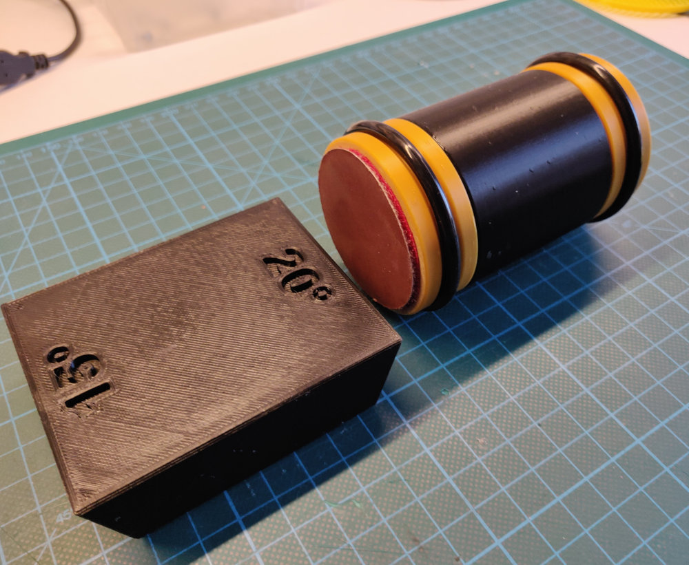

# How to print a knife sharpener

&hellip;inspired by [HORL Rollschleifer](https://www.horl.com/rollschleifer/horl2). The Original.

3D print files provided by [DonPablete](https://www.printables.com/de/social/259025-donpablete):
https://www.printables.com/de/model/291595-tumbler-roller-sharpener-aka-horl

The original works with sanding stones, ceramic or steel - which of course last for years or a life long... but just to test the principle I tried with normal wet sanding paper first.

Additional parts needed:
- 6x neodym magnets 12x2,5mm

- sanding disks, with Velcro backside, diameter 50-55mm, grit 400 + 1000
  - [Feinschleifscheiben Klett Schleifblätter Schleifpapier Exzenter 50mm P400](https://www.ebay.de/itm/203272897784?var=503630285966)
  - [Feinschleifscheiben Klett Schleifblätter Schleifpapier Exzenter 50mm P1000](https://www.ebay.de/itm/203272897784?var=503630285978)
- Velcro counterpart disk
  - [1x Ø 125 mm Klettscheibe selbstklebend Schleifteller Haftscheibe Ersatz Klett](https://www.ebay.de/itm/363663999567)
- (optional) rubber rings (if you can't print flex material)
  - [O-Ringe Ø 50,0 mm , Schnurstärke 4,5 mm NBR70](https://www.ebay.de/itm/331503317790?var=540671207638)
- (optional) foam rubber mat 65x65mm

## Step by step

Print all the parts. Everything than the O-rings can be printed with PLA. If you can't print flex materials, skip the O-rings and buy rubber rings as suggested in the list above.

Cut out disks of ~Ø50mm from the Velcro counterpart (use sanding disks as template) and glue them to the end caps.

Apply rubber rings (printed or bought) and sanding disks. For more stability glue foam rubber mat at bottom of angle block.

Use as recommended:
https://www.horl.com/schaerferatgeber

## Next steps:

Next level: print the [PRO model](https://www.printables.com/de/model/212006-rolling-knife-sharpener-with-inbuilt-planetary-gea) with planetary gear which rotates the sanding disks with x3 speed.
